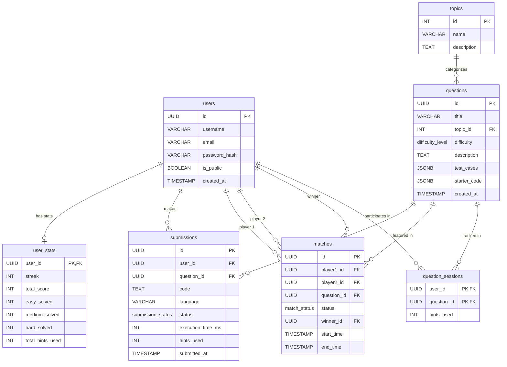

# Database Architecture

## Schema Diagram

## Tables Reference

### Enums
- **`difficulty_level`**: `'Easy'`, `'Medium'`, `'Hard'`
- **`submission_status`**: `'Accepted'`, `'Wrong Answer'`, `'Time Limit Exceeded'`, `'Runtime Error'`, `'Compilation Error'`
- **`match_status`**: `'Pending'`, `'Active'`, `'Completed'`, `'Cancelled'`

### `users`
Core user account information.
| Column | Type | Constraints | Description |
| :--- | :--- | :--- | :--- |
| `id` | UUID | PRIMARY KEY, DEFAULT uuid_generate_v4() | Unique identifier |
| `username` | VARCHAR(50) | UNIQUE, NOT NULL | User's handle |
| `email` | VARCHAR(255) | UNIQUE, NOT NULL | User's email address |
| `password_hash` | VARCHAR(255) | NOT NULL | Hashed password |
| `is_public` | BOOLEAN | DEFAULT true | Profile visibility |
| `created_at` | TIMESTAMP | DEFAULT NOW() | Account creation time |

### `user_stats`
Aggregated statistics for quick profile loading and scoring.
| Column | Type | Constraints | Description |
| :--- | :--- | :--- | :--- |
| `user_id` | UUID | PRIMARY KEY, REFERENCES users(id) ON DELETE CASCADE | Associated user |
| `streak` | INT | DEFAULT 0 | Current daily streak |
| `total_score` | INT | DEFAULT 0 | Gamification score |
| `easy_solved` | INT | DEFAULT 0 | Count of easy problems solved |
| `medium_solved` | INT | DEFAULT 0 | Count of medium problems solved |
| `hard_solved` | INT | DEFAULT 0 | Count of hard problems solved |
| `total_hints_used` | INT | DEFAULT 0 | Overall AI hints consumed |

### `topics`
Categories/tags for questions.
| Column | Type | Constraints | Description |
| :--- | :--- | :--- | :--- |
| `id` | SERIAL | PRIMARY KEY | Unique identifier |
| `name` | VARCHAR(100) | UNIQUE, NOT NULL | Topic name (e.g., Arrays) |
| `description` | TEXT | | Detailed topic description |

### `questions`
Problem definitions, test cases, and starter code.
| Column | Type | Constraints | Description |
| :--- | :--- | :--- | :--- |
| `id` | UUID | PRIMARY KEY, DEFAULT uuid_generate_v4() | Unique identifier |
| `title` | VARCHAR(255) | UNIQUE, NOT NULL | Problem title |
| `topic_id` | INT | REFERENCES topics(id) ON DELETE SET NULL | Associated topic |
| `difficulty` | difficulty_level | NOT NULL | Problem difficulty |
| `description` | TEXT | NOT NULL | Markdown description of the problem |
| `test_cases` | JSONB | NOT NULL | Array of inputs/expected outputs |
| `starter_code` | JSONB | DEFAULT '{}'::jsonb | Initial code per language |
| `created_at` | TIMESTAMP | DEFAULT NOW() | Question creation time |

### `submissions`
Code submissions for questions. Powers heatmap and analytics.
| Column | Type | Constraints | Description |
| :--- | :--- | :--- | :--- |
| `id` | UUID | PRIMARY KEY, DEFAULT uuid_generate_v4() | Unique identifier |
| `user_id` | UUID | REFERENCES users(id) ON DELETE CASCADE | Submitting user |
| `question_id` | UUID | REFERENCES questions(id) ON DELETE CASCADE | Attempted question |
| `code` | TEXT | NOT NULL | Submitted source code |
| `language` | VARCHAR(50) | NOT NULL | Programming language used |
| `status` | submission_status | NOT NULL | Result of evaluation |
| `execution_time_ms`| INT | | Runtime performance |
| `hints_used` | INT | DEFAULT 0 | Hints used during this submission |
| `submitted_at` | TIMESTAMP | DEFAULT NOW() | Timestamp of submission |

### `matches`
Sparring matches between two users.
| Column | Type | Constraints | Description |
| :--- | :--- | :--- | :--- |
| `id` | UUID | PRIMARY KEY, DEFAULT uuid_generate_v4() | Unique identifier |
| `player1_id` | UUID | REFERENCES users(id) | First participant |
| `player2_id` | UUID | REFERENCES users(id) | Second participant |
| `question_id` | UUID | REFERENCES questions(id) | Problem being solved |
| `status` | match_status | DEFAULT 'Pending' | Current state of match |
| `winner_id` | UUID | REFERENCES users(id) | Match winner |
| `start_time` | TIMESTAMP | | Match start time |
| `end_time` | TIMESTAMP | | Match completion time |

### `question_sessions`
Active session tracking for AI Hints.
| Column | Type | Constraints | Description |
| :--- | :--- | :--- | :--- |
| `user_id` | UUID | PRIMARY KEY, REFERENCES users(id) ON DELETE CASCADE | User in session |
| `question_id` | UUID | PRIMARY KEY, REFERENCES questions(id) ON DELETE CASCADE| Question being solved |
| `hints_used` | INT | DEFAULT 0 | Hints requested so far |

### Indexes
- `idx_submissions_user_date` on `submissions(user_id, submitted_at)`
- `idx_questions_topic_difficulty` on `questions(topic_id, difficulty)`
- `idx_users_username` on `users(username)`
